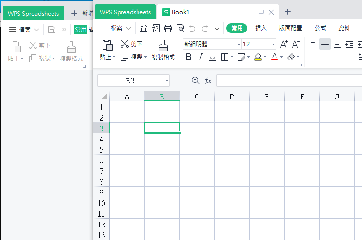

# xlwings 

<a href ="https://docs.xlwings.org/en/stable/">官網教學</a>

## install 

```
    pip install xwings    
```

## 架構
操作分三部分
<ul>
    <li>app</li>
    <li>book</li>
    <li>sheet</li>
</ul>


## App
App 就是excel 的實例,每個app 可以有很多workbook

### create_app

visible用來設定程式是否可見，True表示可見（預設），Flase不可見。<br>
add_book用來設定是否自動建立工作簿，True表示自動建立（預設），False不建立<br>

```python
app1 = xw.App(visible = True, add_book = True) 
app2 = xw.App(visible = True, add_book = False)

```
左邊為app2,右邊為app1<br>




### get pid
```python
app1.pid
```

### set activate app

```python
app1.activate()
app1.activate(steal_focus=True)
```
當steal_focus=True時, Excel程式變成最前台的應用，並且把焦點從Python切換到Excel

### get current activate app
```python
xw.apps.active
```

### show app books
```python
app2.books

app1.activate()
xw.books
```


### using app open new excel
```python 
app =xw.App(visible = False,add_book = False)
wb = app.books.add()
wb.save('1.xlsx')
wb.close()
app.quit()
```


## Book

### create new book

create book at app1
```python 
#using app
wb = app1.books.add()
```
create book at active app
```python 
#using app
app2.activate()
xw.Book()
# or
xw.books.add()
```


### open exist book
```python    
wb = xw.Book("data.xls")
#using app
wb = app.books.open('data.xlsx')
``` 
### get book

get book from specific app
```python    
# get app1 book1
wb = app1.books(1)
wb = app1.books[0]

wb = xw.books["Book1"]

``` 
get book from active app
```python    
app2.activate()
wb = xw.books(2)
``` 


## Sheet
<a href = "https://docs.xlwings.org/en/stable/api.html#sheet">官網教學</a>

### get sheets/sheets

取得所有sheets
```python
>>> wb.sheets
Sheets([<Sheet [Book1]Sheet1>])
```

get sheet
```python
>>> wb.sheets[0]
<Sheet [123.xlsx]Sheet1>
>>> wb.sheets(1)
<Sheet [123.xlsx]Sheet1>
>>> wb.sheets["Sheet1"]
<Sheet [123.xlsx]Sheet1>
```

### add sheet
有三個參數
```python
add(name=None, before=None, after=None)
```
插入在sheet1之前

```python
wb.sheets.add('Sheet0',before = "Sheet1")
```
插入在Sheet1之後
```python
wb.sheets.add('Sheet2',after = "Sheet1")
```
### delete sheet
```python
>>> wb.sheets["Sheet2"].delete()
<Sheet [simple.xlsx]Sheet1>
```

### autofit sheet

<ul class="simple">
<li><p>To autofit rows, use one of the following: <code class="docutils literal notranslate"><span class="pre">rows</span></code> or <code class="docutils literal notranslate"><span class="pre">r</span></code></p></li>
<li><p>To autofit columns, use one of the following: <code class="docutils literal notranslate"><span class="pre">columns</span></code> or <code class="docutils literal notranslate"><span class="pre">c</span></code></p></li>
<li><p>To autofit rows and columns, provide no arguments</p></li>
</ul>


```python
wb.sheets['Sheet1'].autofit('c')
wb.sheets['Sheet1'].autofit('r')
wb.sheets['Sheet1'].autofit()
```
### clear
Clears the content and formatting of the whole sheet.
```python
wb.sheets['Sheet1'].clear()
```

### clear_contents()
Clears the content of the whole sheet but leaves the formatting.
```python
wb.sheets['Sheet1'].clear_contents()
```

### copy data
```python

# Create two books and add a value to the first sheet of the first book
first_book = xw.Book()
second_book = xw.Book()
first_book.sheets[0]['A1'].value = 'some value'

# Copy to same Book with the default location and name
first_book.sheets[0].copy()

# Copy to same Book with custom sheet name
first_book.sheets[0].copy(name='copied')

# Copy to same Book with custom sheet name with specific loc
first_book.sheets[0]['A1:C3'].copy(first_book.sheets['copied'].range('A2'))

# Copy to second Book requires to use before or after
first_book.sheets[0].copy(after=second_book.sheets[0])

```

### to Pdf
```python
wb = xw.Book()
sheet = wb.sheets[0]
sheet['A1'].value = 'PDF'
sheet.to_pdf()
```

## How to get Range(Cell/Cells)


### get single cell

<table>
    <caption>Get B1 Cell</caption>
    <thead>
        <tr>
            <td>Refernece</td>
            <td>Description</td>
        </tr>
    </thead>
    <tbody>
        <tr>
            <td>sheet1.cells(1, 2)</td>
            <td>注意啟始位置為1</td>
        </tr>
        <tr>
            <td>sheet1.range(1,2)</td>
            <td>注意啟始位置為1</td>
        </tr> 
        <tr>
            <td>sheet1.range("B1")</td>
            <td></td>
        </tr>
        <tr>
            <td>sheet1["B1"]</td>
            <td>同sheet1.range("B1")只是省略range</td>
        </tr>   
        <tr>
            <td>sheet1[0, 1]</td>
            <td>利用切片</td>
        </tr>        
    </tbody>
</table>


### get range cell
主要有三種方法

<ul>
    <li>sheet1.range("reference")/sheet1["reference"]</li>
    <li>sheet1.range(cell1, cell2=None)</li>
    <li>利用切片</li>
</ul>

<table>
    <caption>Strings to define a range in A1 notation</caption>
    <thead>
        <tr>
            <td>Description</td>
            <td>How to Use</td>
        </tr>
    </thead>
        <tbody>       
        <tr>            
            <td>Cells from A1 to B2</td>
            <td>sheet1.range("A1:B2")/sheet1["A1:B2"]/sheet1.range((1, 1), (2, 2))/sheet1[:2, :2]</td>
        </tr>  
        <tr>            
            <td>Column A</td>
            <td>sheet1.range("A:A")/sheet1["A:A"]/sheet1[:,0]</td>
        </tr> 
        <tr>
            <td>Columns A to B</td>
            <td>sheet1.range("A:B")/sheet1["A:B"]/sheet1[:,:2]</td>           
        </tr>
        <tr>
            <td>Row 1</td>
            <td>sheet1.range("1:1")/sheet1["1:1"]/sheet1[0,:]</td>           
        </tr>  
        <tr>
            <td>Rows 1 to 2</td>
            <td>sheet1.range("1:2")/sheet1["1:2"]/sheet1[:2,:]</td>           
        </tr> 
    </tbody>
</table>


## How to write value
知道如何get range 只需要使用value ,即可寫值

### write single value

在B1寫值
<ul>
    <li>sheet1.cells(1, 2).value</li>
    <li>sheet1.range(1, 2).value</li>
    <li>sheet1.range('B1').value </li>
    <li>sheet1[0,1].value</li>
</ul>
 

```python
sheet1.cells(1, 2).value = "test"; 
sheet1.range(1, 2).value = "test"; 
sheet1.range('B1').value = "test"; 
sheet1[0,1].value = "test"; 
```

### write range value

從指定位置寫入row datas
```python
#write value from A2 ->E2
sheet1.range('A2').value = [1,2,3,4,5]
sheet1.range(2, 1).value =[1,2,3,4,5]
sheet1[1,0].value = [1,2,3,4,6]
```

從指定位置寫入 col datas
```python
sheet1.range('A2').value = [[1], [2],[3]]

#or use transpose
sheet1.range('A2').options(transpose=True).value=[1,2,3]
```

從指定位置寫入多行,但是筆數不一樣

```python
#write value from A2 ->E2
#write second array value from A3 ->C3
sheet1.range('A2').value = [['Foo 1', 'Foo 2', 'Foo 3'], [10.0, 20.0, 30.0]]
```


### write data using pandas/numpy

可以透過 expand() 方法，或是 options 方法的 expand 參數動態偵測並且讀取一個連續、有值的儲存格範圍的資料。<br>
這邊需要注意的是，expand() 方法會回傳一個 range() 物件，而 options(expand='table') 則會在選定一個範圍之後才會被執行<br>

```python
import pandas as pd
df = pd.DataFrame([[1,2], [3,4]], columns=['a', 'b'])

#下面方法在write 時並不影響
sheet1.range('A1').options(expand='table').value = df
sheet.range('A1').value = df
#sheet.range('A1').options().value
sheet1.range('A1').expand('table').value = df #or just expand()

```

指定不要index,和head

```python
sheet1.range('A1').options(expand='table',index=False, header=False).value = df

```

also can use numpy

```python
import numpy as np
arr = np.zeros(shape= (6,6))
for i in range(1,6):
    for j in range(1,6):
        arr[i - 1][j - 1] = i * j

sheet1.range('A1').options(expend='table').value = arr
```


### write figure by Matplotlib 
```python
import matplotlib.pyplot as plt
fig = plt.figure()
plt.plot([1, 2, 3, 4, 5])
sheet1.pictures.add(fig, name='MyPlot', update=True)
```

指定放置位置

```python
sheet1.pictures.add(fig, name='MyPlot', update=True,left=sheet.range('B5').left, top=sheet.range('B5').top)

```

also can use pandas with matplotlib

```python
import pandas as pd
import numpy as np
import matplotlib.pyplot as plt
df = pd.DataFrame(np.random.rand(10, 4), columns=['a', 'b', 'c', 'd'])
ax = df.plot(kind='bar')
fig = ax.get_figure()
sheet1.pictures.add(fig, name='MyPlot', update=True)
```


## How to read value

首先我們先寫個値進去
```python
import xlwings as xw
import pandas as pd
import numpy as np

path = "simple.xlsx"
wb = xw.Book() 
sheet = wb.sheets[0] 
sheet = wb.sheets[0]
df = pd.DataFrame(np.random.rand(5, 4), columns=['a', 'b', 'c', 'd'])
sheet1.range('A1').options(expand='table').value = df

```

```python
>>> df
          a         b         c         d
0  0.921002  0.258183  0.417066  0.712426
1  0.854319  0.950455  0.655083  0.405378
2  0.731881  0.271852  0.002059  0.663275
3  0.215696  0.085970  0.155741  0.378884
4  0.783033  0.282854  0.561799  0.549592

```
### using index 

使用座標(row,col),注意index 由1開始
```python
>>> sheet.cells(2, 2).value
0.9210020590149163
```

### using name 
```python
>>> sheet['B2'].value
0.9210020590149163
```

### read range value

#### read col

```python
>>> sheet.range('B2:B6').value
[0.9210020590149163, 0.8543194171695255, 0.7318809859654273, 0.21569586136981367, 0.7830330228949836]
```

如果希望回傳2d list

```python
>>> sheet.range('B2:B6').options(ndim = 2).value
[[0.9210020590149163], [0.8543194171695255], [0.7318809859654273], [0.21569586136981367], [0.7830330228949836]]
```

#### read row

```python
>>> sheet.range('B2:E2').value
[0.9210020590149163, 0.2581829142794191, 0.4170663337627397, 0.7124263358483016]
>>> sheet.range('B2:E6').value
```

如果希望回傳2d list
```python
>>> sheet.range('A2:E2').options(ndim=2).value
[[0.0, 0.9210020590149163, 0.2581829142794191, 0.4170663337627397, 0.7124263358483016]]
```

#### read all
```python
sheet.range('B2:E6').value
```
也可以使用座標(row,col)

```python
sheet.range((2,2),(6,5)).value
```

using expand read,注意expand 是動態偵測並且讀取一個連續、有值的儲存格範圍,如果單讀在F7填値的話會抓取不到

```python
sheet.range('B2').expand().value
```

### read data by option/convert

#### numbers
```python
>>> sheet.range('A1').value
4.0
>>> sheet.range('A1').options(numbers=int).value
4
>>>
```
#### empty
```python
>>> sheet.range('B1').value
>>> sheet.range('B1').options(empty='NA').value
'NA'
```

#### read as dict

A :1
B :2

```python
>>> sheet.range('C1:D2').options(dict).value
{'A': 1.0, 'B': 2.0}
```

C D 
1 2 
```python
>>> sheet.range('C5:D6').options(dict, transpose=True).value
{'C': 1.0, 'D': 2.0}
```

### read data to pandas data/numpy data
透過 expand() 方法，或是 options 方法的 expand 參數動態偵測並且讀取一個連續、有值的儲存格範圍的資料。<br>
這邊需要注意的是，expand() 方法會回傳一個 range() 物件，而 options(expand='table') 則會在選定一個範圍之後才會被執行<br>

```python
>>> sheet.range('A1').options(pd.DataFrame, header=1,index=True, expand='table').value
            a         b         c         d
0.0  0.921002  0.258183  0.417066  0.712426
1.0  0.854319  0.950455  0.655083  0.405378
2.0  0.731881  0.271852  0.002059  0.663275
3.0  0.215696  0.085970  0.155741  0.378884
4.0  0.783033  0.282854  0.561799  0.549592
>>>
```

read as numpy data
```python
>>> sheet.range('B1').options(np.array, expand='table').value
array([['a', 'b', 'c', 'd'],
       ['0.9210020590149163', '0.2581829142794191', '0.4170663337627397',
        '0.7124263358483016'],
       ['0.8543194171695255', '0.9504553265761788', '0.6550831494071169',
        '0.4053778602050133'],
       ['0.7318809859654273', '0.27185191903152106',
        '0.0020588589304098015', '0.6632746573361699'],
       ['0.21569586136981367', '0.08597000792113141',
        '0.15574106685749678', '0.37888448435765365'],
       ['0.7830330228949836', '0.2828543736018313', '0.5617992477223079',
        '0.5495923143642101']], dtype='<U21')
>>>
```

### different options vs expand

```python
>>> sheet.range('A1').value = [[1,2], [3,4]]
>>> rng1 = sheet.range('A1').expand('table')
>>> rng2 = sheet.range('A1').options(expand='table')
>>> rng1
<Range [simple.xlsx]Sheet1!$A$1:$B$2>
>>> rng2
<Range [simple.xlsx]Sheet1!$A$1>
>>> rng1.value
[[1.0, 2.0], [3.0, 4.0]]
>>> rng2.value
[[1.0, 2.0], [3.0, 4.0]]
>>> sheet.range('A3').value = [5, 6]
>>> rng1.value
[[1.0, 2.0], [3.0, 4.0]]
>>> rng2.value
[[1.0, 2.0], [3.0, 4.0], [5.0, 6.0]]
>>>

```

## Get/Set Style


### Font
<ul>
    <li>bold</li>
    <li>color</li>
    <li>italic</li>
    <li>name</li>
    <li>size</li>
</ul>

```python
>>> sheet['A1'].font.bold
False
>>> sheet['A1'].font.color
(0, 0, 0)
>>> sheet['A1'].font.italic
False
>>> sheet['A1'].font.name = 'Calibri'
>>> sheet['A1'].font.size = 13
>>>
```

```python
sheet['A1'].color = 255,200,255         
sheet['A1'].api.Font.ColorIndex = 3     
sheet['A1'].api.Font.Size = 24          
sheet['A1'].api.Font.Bold = True        
sheet['A1'].api.HorizontalAlignment = -4108    # -4108 水平居中。 -4131 靠左，-4152 靠右。
sheet['A1'].api.VerticalAlignment = -4130      # -4108 垂直居中（默认）。 -4160 靠上，-4107 
```


### Border

使用sheet['A1'].api.Borders(n)做為接口

<table>
    <thead>
        <tr>
            <th>Number</th>
            <th>位置</th>
        </tr>
    </thead>
    <tbody>
        <tr>
            <td>5</td>
            <td>左上到右下</td>
        </tr>
        <tr>
            <td>6</td>
            <td>左下到右上</td>
        </tr> 
        <tr>
            <td>7</td>
            <td>左</td>
        </tr> 
        <tr>
            <td>8</td>
            <td>上</td>
        </tr> 
        <tr>
            <td>9</td>
            <td>底部</td>
        </tr>
        <tr>
            <td>10</td>
            <td>右邊</td>
        </tr>
    </tbody>
</table>

<ul>
    <li>LineStyle</li>
    <li>Weight</li>
</ul>

```python
sheet['A1'].api.Borders(9).Weight = 3
sheet['A1'].api.Borders(9).LineStyle = 3
```


## Add chart 


```python
import xlwings as xw
sht = xw.Book().sheets[0]
sht.range('A1').value = [['Foo1', 'Foo2'], [1, 2]]
chart = sht.charts.add(left=sheet.range('B5').left, top=sheet.range('B5').top)
chart.set_source_data(sht.range('A1').expand())
chart.chart_type = 'line'
chart.to_png(path="777.png")

```


## Wrire/Read Big Data

需要寫大量資料建議用datafram 或是np array,下列寫入100*100陣列,逐筆寫入需要121秒,一次寫入只需要1秒


```python
import xlwings as xw
import time
import pythoncom
import numpy as np
import pandas as pd

def write_value_by_cells():
    t1 = time.time() 
    debug = True
    app = xw.App(visible =debug, add_book=True)  
    app.screen_updating = debug
    app.display_alerts = False
    
    path = "test.xlsx"
    wb = xw.Book(path)    
    ws = wb.sheets[0]     
    for i in range(1,101):
        for j in range(1,101):
            ws.cells(i, j).value = i * j; 

    t2= time.time()
    print (t2 - t1)
    wb.save()
    wb.close()
    app.quit()


def write_value_by_range():
    t1 = time.time()
    
    debug = False
    app = xw.App(visible =debug, add_book=True)  
    app.screen_updating = debug
    app.display_alerts = False   
    wb = xw.Book()
    path = "test2.xlsx"   
    ws = wb.sheets[0] 
    
    arr = np.zeros(shape= (100,100))    
    for i in range(1,101):
        for j in range(1,101):
            arr[i - 1][j - 1] = i * j
    
    ws.range('A1').options(expend='table').value = arr     
    wb.save(path)
    wb.close()
    app.quit()
    
    t2= time.time()  
    print (t2 - t1)
 ```

如果遇到超時或內存錯誤,可以執行分塊,理想的塊大小將取決於您的系統和數組的大小，因此您必須嘗試幾種不同的塊大小以找到一種運行良好的塊大小：


```python
import pandas as pd
import numpy as np
sheet = xw.Book().sheets[0]
data = np.arange(75_000 * 20).reshape(75_000, 20)
df = pd.DataFrame(data=data)
sheet['A1'].options(chunksize=10_000).value = df
```

And the same for reading:
```python
# As DataFrame
df = sheet['A1'].expand().options(pd.DataFrame, chunksize=10_000).value
# As list of list
df = sheet['A1'].expand().options(chunksize=10_000).value
```


